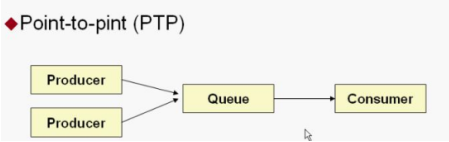
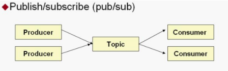

# JMS
消息中间件学习
## 消息中间件
消息中间件利用高效可靠的消息传递机制进行平台无关的数据交流，并基于数据通信来进行分布式系统的集成。通过提供消息传递和消息排队模型，它可以在分布式环境下扩展进程间的通信。对于消息中间件，常见的角色大致也就有Producer（生产者）、Consumer（消费者）
### 常见消息中间件产品
* ActiveMQ   
ActiveMQ 是Apache出品，最流行的，能力强劲的开源消息总线。ActiveMQ 是一个完全支持JMS1.1和J2EE 1.4规范的 JMS Provider实现。我们在本次课程中介绍 ActiveMQ的使用。
* RabbitMQ   
AMQP协议的领导实现，支持多种场景。淘宝的MySQL集群内部有使用它进行通讯，OpenStack开源云平台的通信组件，最先在金融行业得到运用。
* ZeroMQ   
史上最快的消息队列系统
* Kafka   
Apache下的一个子项目 。特点：高吞吐，在一台普通的服务器上既可以达到10W/s的吞吐速率；完全的分布式系统。适合处理海量数据。
## JMS
>JMS（Java Messaging Service）是Java平台上有关面向消息中间件的技术规范，它便于消息系统中的Java应用程序进行消息交换,并且通过提供标准的产生、发送、接收消息的接口简化企业应用的开发。
* JMS 定义了五种不同的消息正文格式，以及调用的消息类型，允许你发送并接收以一些不同形式的数据，提供现有消息格式的一些级别的兼容性。   
· TextMessage--一个字符串对象   
· MapMessage--一套名称-值对   
· ObjectMessage--一个序列化的 Java 对象   
· BytesMessage--一个字节的数据流   
· StreamMessage -- Java 原始值的数据流   
### JMS消息传递类型
* 
* 点对点，生产者消费者一对一
    * 点对点的模式主要建立在一个队列上面，当连接一个列队的时候，发送端不需要知道接收端是否正在接收，可以直接向ActiveMQ发送消息，发送的消息，将会先进入队列中，如果有接收端在监听，则会发向接收端，如果没有接收端接收，则会保存在activemq服务器，直到接收端接收消息，点对点的消息模式可以有多个发送端，多个接收端，但是一条消息，只会被一个接收端给接收到，哪个接收端先连上ActiveMQ，则会先接收到，而后来的接收端则接收不到那条消息。
* 
* 发布订阅，一个生产者发布消息，多个消费者接受
### ActiveMQ下载安装
官方网站下载：http://activemq.apache.org/   
启动： ./activemq start（admin/admin）
## 入门demo
[demo调转](./jmsDemo/src/main/java/)